# Setting up a 4-Node Server Cluster in VirtualBox
## Table of Contents
1. [Installing Virtual Box](#installing-virtual-box)
2. [Installing Ubuntu Server 14.04.5 LTS on a VM](#installing-ubuntu-server-14045-lts-on-a-vm)
3. [Setting Up Our Internal Network To Use Static IP Addresses](#setting-up-our-internal-network-to-use-static-ip-addresses)
4. [Getting Corosync installed](#getting-corosync-installed)

## Installing Virtual Box
* We are using Oracle VirtualBox 5.1.6 to run four virtual servers. 
 
* You can download VirtualBox here: https://www.virtualbox.org/wiki/Downloads
 
1. Run the setup file and it should walk you through a pretty standard installation
2. Congratulations, VirtualBox is installed. When you run VirtualBox it should look something like this:
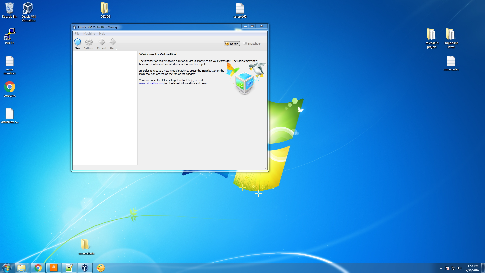

## Creating a new Virtual Machine
* Ultimately, we want install Ubuntu Server on a VM, but first we have to create a blank VM VirtualBox and alter some settings

1. Open VirtualBox and click the create button. Give the Virtual Machine (VM) a name and in the dropdown menus select Linux and Ubuntu (64-bit). Then click 'next'.
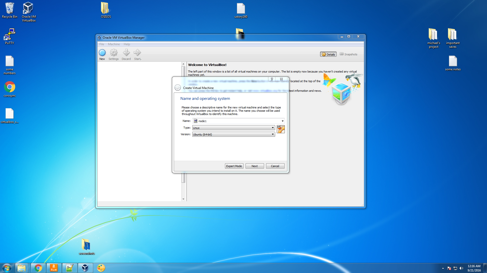
2. VirtualBox will ask you to choose the amount of RAM allocated to the VM. I gave it 1024MB. Then click 'next'.
3. VirtualBox will ask you to add a virtual hard disk. With 'Create a virtual hard disk now' selected click 'create'.
4. VirtualBox will ask you to choose a hard disk file type --choose 'VDI'. 
5. VirtualBox will then ask you how your virtual hard disk should grow --choose 'Dynamically allocated'.
6. VirtualBox will then ask you for the virtual hard disk file location and size --I left the location as default and chose 8GB as my size. Then click 'create'
7. You should return to the main VirtualBox window your newly created VM listed along the lefthand side.
8. Right-click on the VM you just created and select Settings from the dropdown menu that appears.
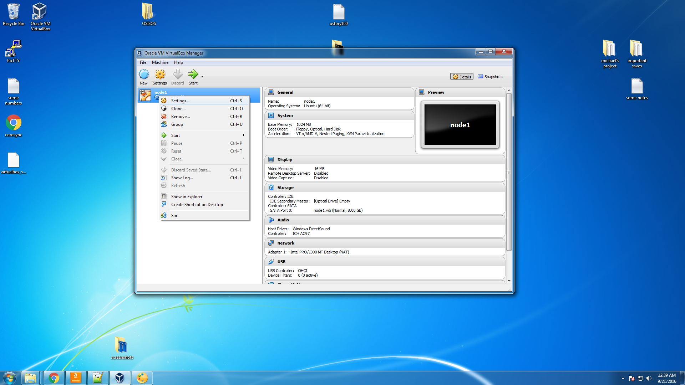
9. In the settings menu, navigate to the Network options. Under the Adapter 1 tab, change the 'Attached to' selection to 'Bridged Adapter'. This adapter, called eth0 in Ubuntu, will be your VM's connection to the internet. It doesn't even necessarily have to be a 'bridged adapter'. If Ubuntu is unable to establish an internet connection with the 'bridged adapter' setting, you can try changing the 'attached to' setting from 'bridged adapter' to 'NAT', which should also provide your VM a connection to the internet.

10. While still in the Network menu, change to the Adapter 2 tab. Check the 'Enable Network Adapter Box', and change the 'Attached to' selection to 'Internal Network'. A text box for naming this network appears, you can name it whatever you want, but make sure that all the other VMs you create use this same name for its internal network.
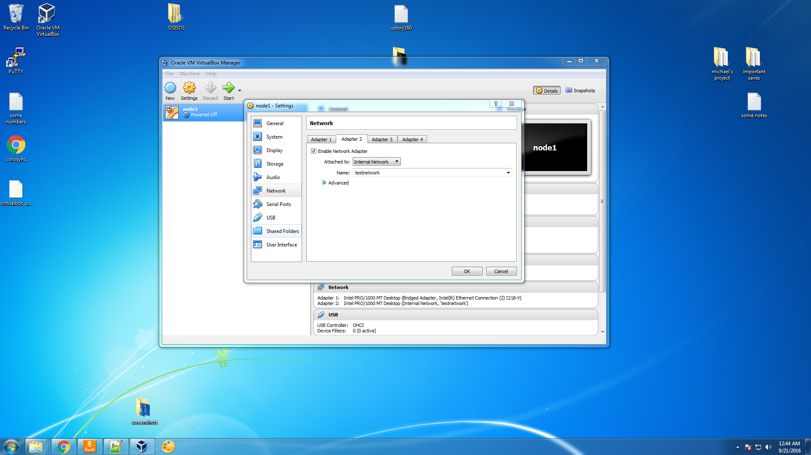
11. Congratulations, you made your first blank VM! Now lets install Ubuntu on it.

## Installing Ubuntu Server 14.04.5 LTS on a VM
* We are using the VM created above to run Ubuntu Server 14.04.5 LTS 
* Before you start, download the the .iso file here: http://releases.ubuntu.com/14.04/
* Be sure to download the *server* install image and, for the sake of consistency among our setups, download the 64-bit version; however, if you are having problems with the 64-bit version, there might be no issues with the 32-bit version

1. In VirtualBox, with the blank VM selected click 'Start'. You will be prompted to select a virtual optical disk to boot from, choose the Ubuntu .iso file you downloaded earlier.
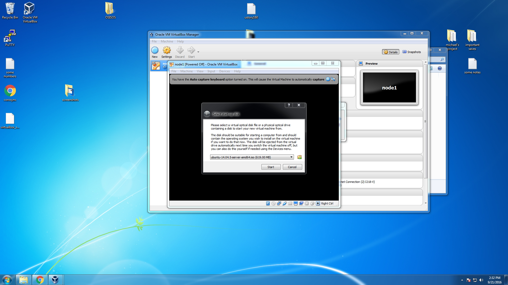
2. You should soon see the Ubuntu installer screen. It asks for a language first and then takes you to a menu. Choose 'Install Ubuntu Server' at this menu.
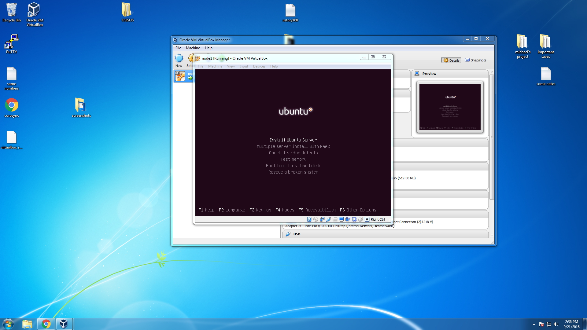
3. There will be prompts asking for language, location and asking to detect your keyboard layout (just choose 'no' for this one and manually select your keyboard layout, it's defaulted to United States anyway). 
4. You should finally reach a screen asking to configure the network and choose your primary network during installation. If you set up the networks properly when creating the VM earlier you should see two choices here: eth0 and eth1. Choose eth0 and continue.
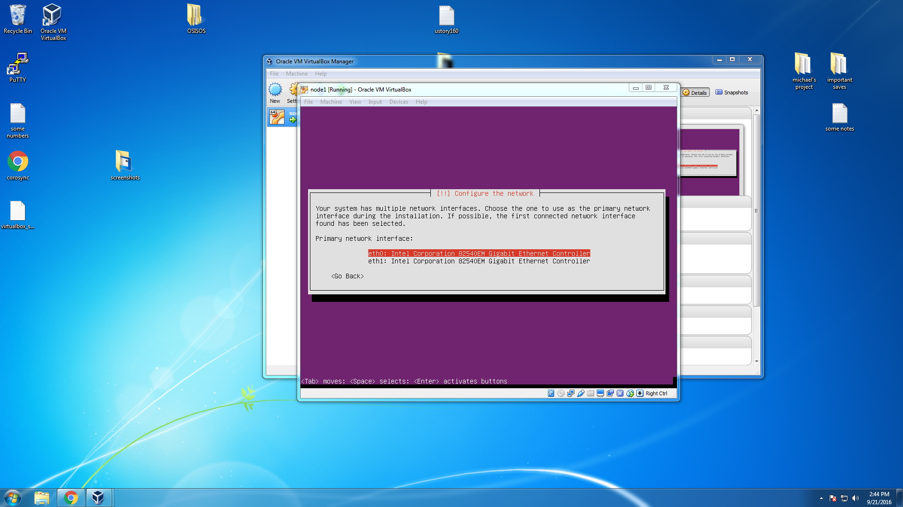
5. You will then be asked to provide a host name. You can name this whatever you want, but you should pick something that differentiates it from the 3 other VMs you eventually be running; I used node1, for example.

6. Next you will be asked to provide a name of the user. You can use whatever name you want but I would use the same name across all 4 machines. You will immediately afterwords be asked to provide a username, just use the same name you provided earlier(also use this same username across all 4 VMs).
7. Next you will be asked to provide a password. I kept it simple with 'root', but you can use whatever you want. For your own sanity, use this same password for all 4 VMs.
8. You will then be asked if you want to encrypt your home directory. Just enter 'no'.
9. Ubuntu will ask you if the timezone it thinks you are in is correct. Just enter 'yes'
10. Ubuntu will then ask you for a partitioning method. Just enter 'Guided - use entire disk'. Ubuntu will also ask you to confirm the  partition disk. Confirm it and move on. Then it will ask you if you want to write changes to disk, enter 'yes'.
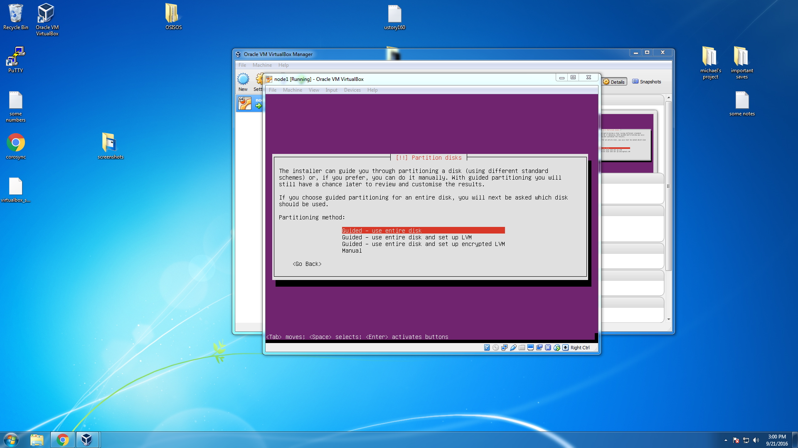
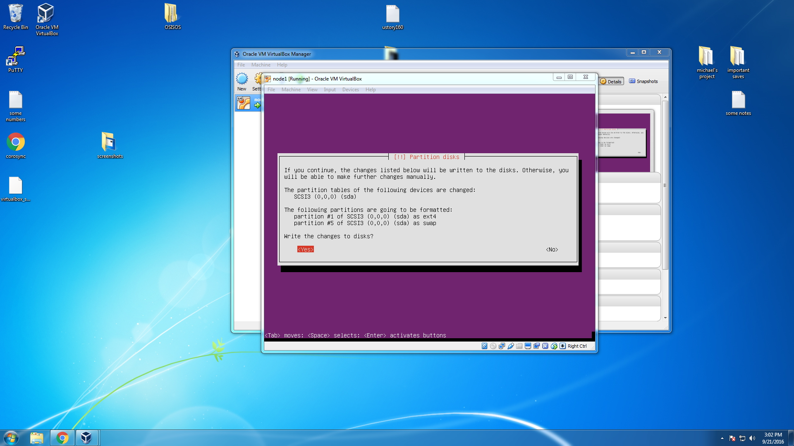
11. Ubnutu will ask you if you are using a proxy. You probably arn't, so just leave this blank and enter 'continue'.
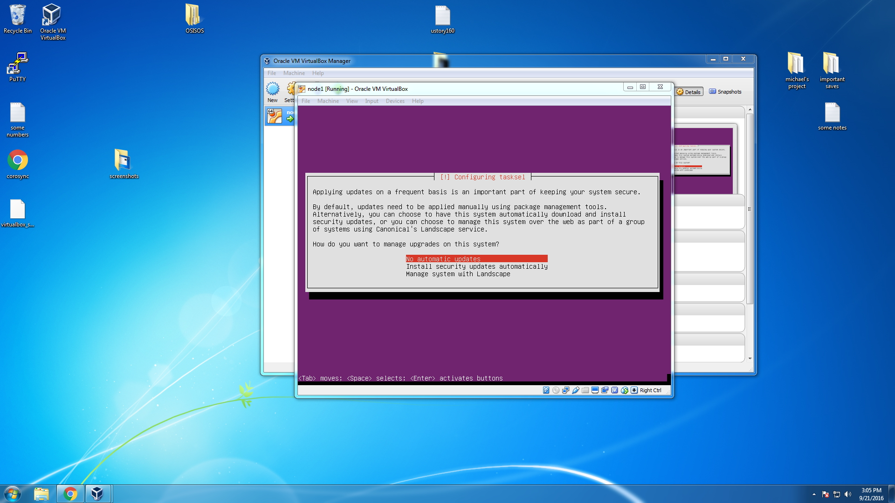
12. Ubuntu will ask you how to manage updates, choose 'no automatic updates' and continue. Ubuntu will ask if you want to install some commonly used software; we don't need to quite yet, so don't select anything and enter 'continue'.
13. We are almost done! Enter 'yes' when asked to install the GRUB boot loader. Once installed it will prompt a reboot.
14. Congratulations, Ubuntu is installed on this VM.
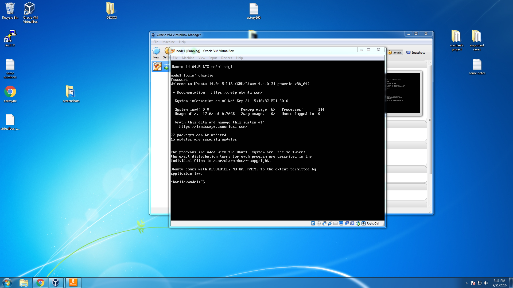

## Setting Up our Internal Network To Use Static IP Addresses
* Before starting to set up our network, we obviously need more than one VM. Repeat the 'Creating a New Virtual Machine' and 'Installing Ubuntu Server 14.04.5 LTS on a VM' 3 more times until you have 4 VMs with Ubuntu installed.

1. Start by powering on your first VM. I will refer to them as nodeN from now on. Once node1 is powered on, you will need to login with the username and password you provided during installation. 
2. Next, enter the command 'sudo -i' and provide your password. We will be editing a lot of important files during this process, and this command will save you the headache of having to put sudo before every command and entering your password everytime you want to change something.
3. Next, type ifconfig. You should see an overview of the network interfaces. eth0 is your bridged adapter that you made earlier. You might notice that eth1 is missing. Thats fine, we are changing that in just a minute.
4. We need to edit the the network interface file located in /etc/network/interfaces. use the command vi /etc/network/interfaces to begin editing the file.
5. If you are unfamiliar with the default editor vi, it is pretty simple: there are two modes, command mode (the mode you begin in) and insert mode(the mode you use to actually type something). While in command mode you can move the cursor with the arrow keys, and when it is in a place you'd like to start editing hit the 'i' key to enter insert mode. To reenter command mode hit 'esc' key. To save and quit, while in command mode type :wq (write quit). to leave without saving just type :q.  
6.  Add the following to the end of the /etc/network/interfaces file:
```code
 auto eth1
 iface eth1 inet static
 address 10.0.0.1 #this is an arbitrary static address we are giving to this node, for each n node this needs to change to 10.0.0.n
 netmask 255.255.255.0
 network 10.0.0.0
```
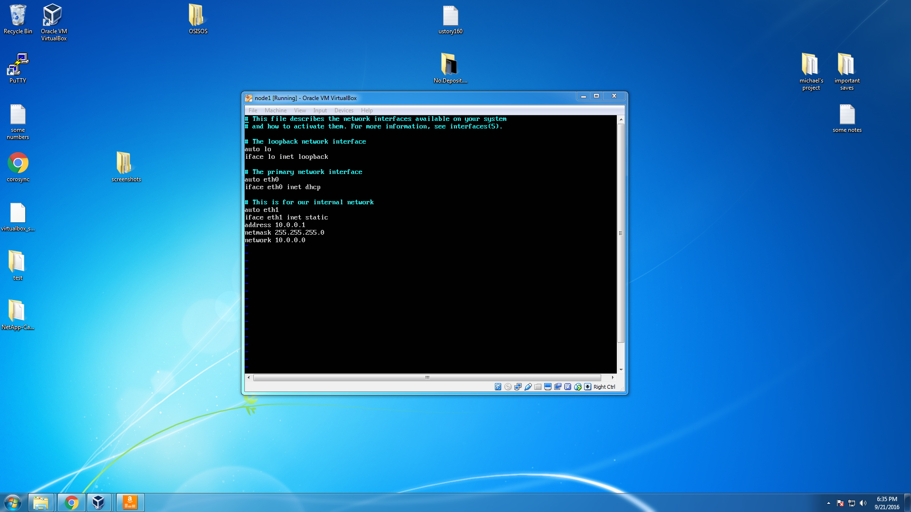

7. After adding this, reenter command mode by hitting 'esc', then type :wq to write-quit aka save it.
8. Next we need to edit our hosts file found at /etc/hosts. so enter the command vi /etc/hosts to begin editing it.
9. Below where it says 'local hosts', comment out the existing address for node1 (or whatever you called this VM). Then add the following:
```code
 10.0.0.1 node1.home node1
 10.0.0.2 node2.home node2
 10.0.0.3 node3.home node3
 10.0.0.4 node4.home node4
```
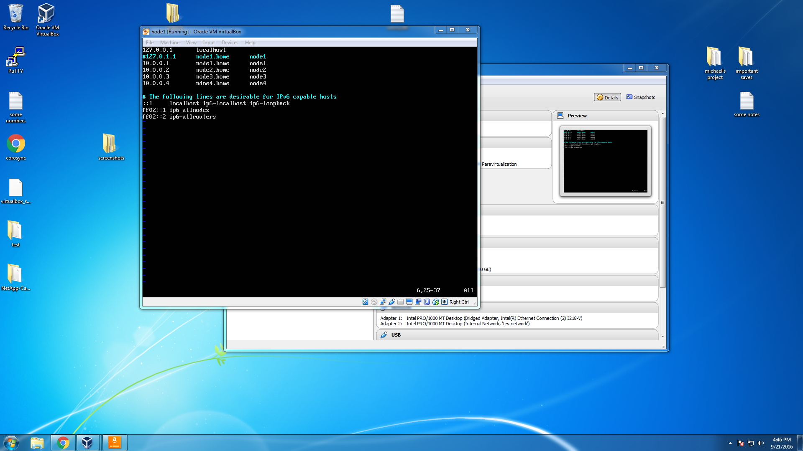

10. Save those changes and return to the command line. Now comes the tedious part. You will need to edit these files on all 4 VMs. You can either repeat the above 8 steps 3 more times or try something fancy involving scp.
11. Once the /etc/network/interfaces file and the /etc/hosts file have been edited on all machines, we are ready to test the network!
12. First, in each VM enter the command ifup eth1. 
13. Then enter the command ifconfig again and now you should see our eth1 network!
14. Then from each node, try to ping the other nodes by their host name. In this example, from VM node1 I entered the command ping node4. You should recieve confirmation that packets were transmitted (hit 'ctrl' + 'c' to stop the ping). Most importantly, make sure the ip address in parenthesis next to the name is the same static ip address we set up earlier. 
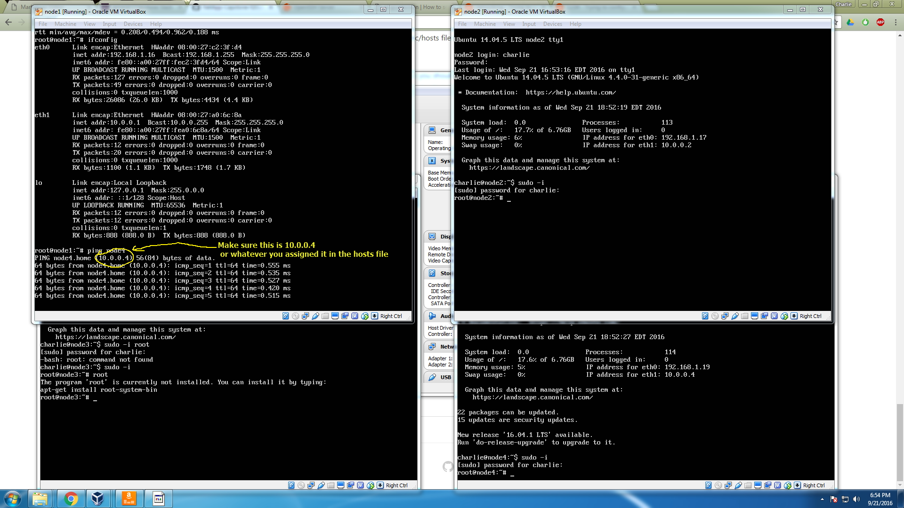
15. Finally, make sure you still have access to the internet through eth0. just ping www.google.com and see if you get anything.
16. Congratulations! our network is setup!

## Getting Corosync installed
* Use the command ```apt-get install corosync``` to install corosync on each node.
* Use vi /etc/corosync/corosync.conf to access the the file. Comment out where it currently says bindnetaddr, then on the next line add: 'bindnetaddr: 10.0.0.0'. You'll notice this is the network we setup earlier.
* You can check that things are proceeding along correctly by entering the command corosync -f which will prompt the VM to begin running corosync. It tells you how many members there are and some other status information. As you enter this command on every VM you should see updates on all machines currently running corosync indicating a new member has been added. cool!
